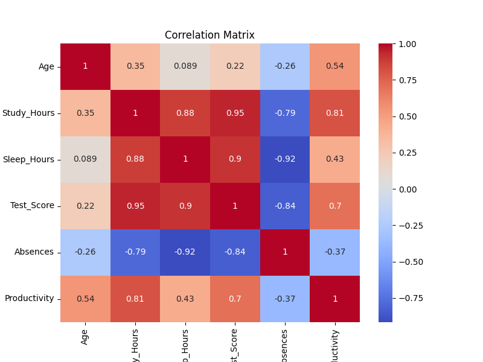
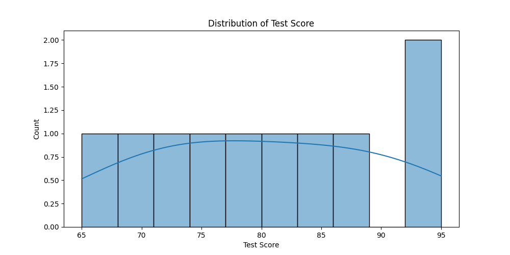
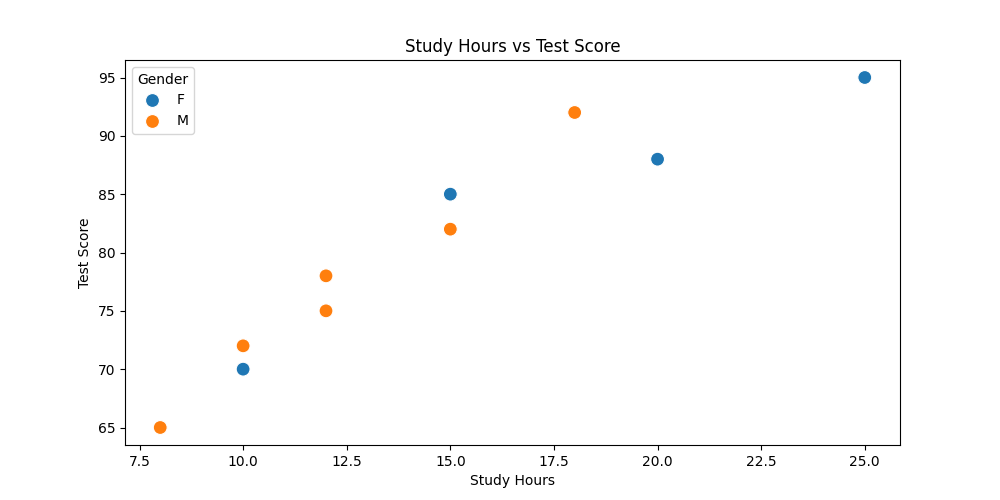
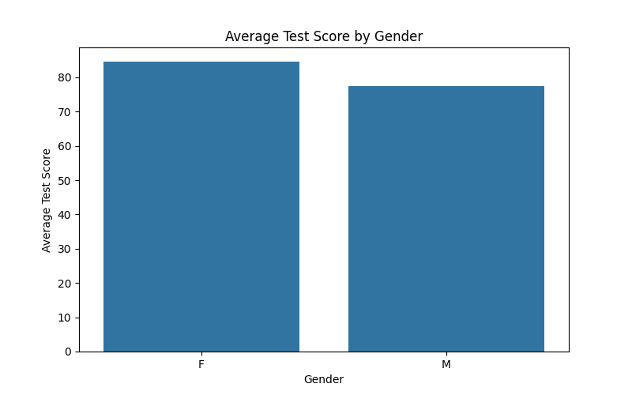
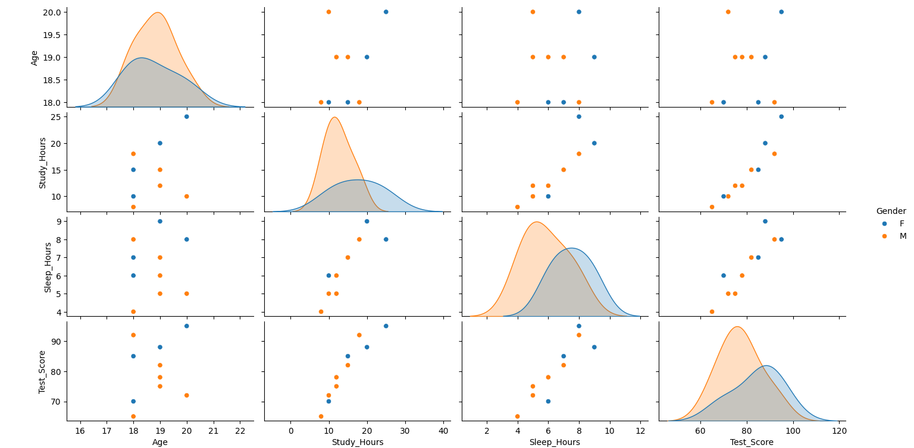
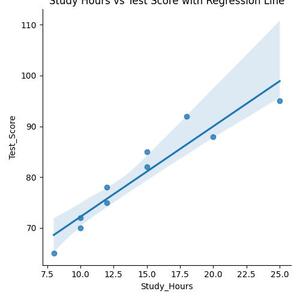
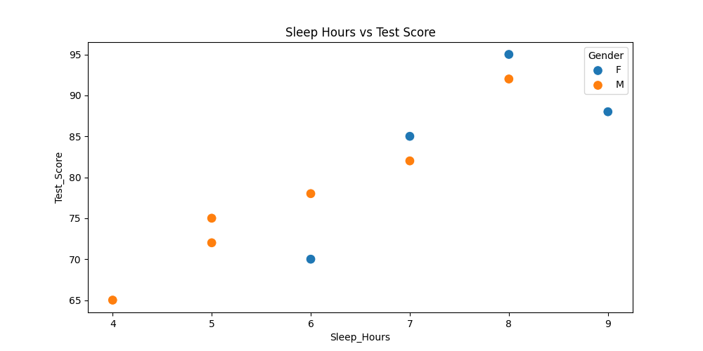
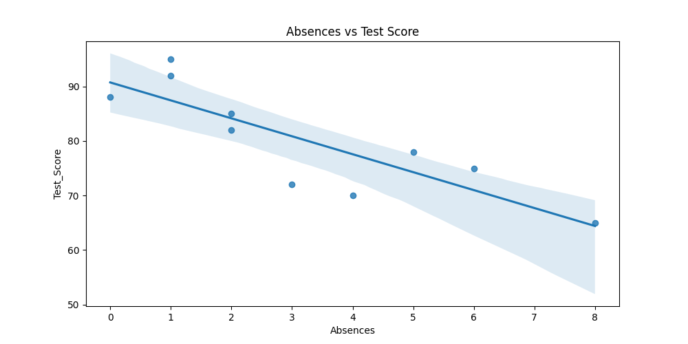

# Student_Performance_Evaluation
A simple Python data analysis project based on student performance. Important libraries used in this project are numpy, pandas, matplotlib, pyplot, and seaborn. 
Answering questions from this dataset includes:
1. Correlation of Productivity

2.  Distribution of Test Scores

3.  Relationship between Study Hours and Test Scores

4.  Average Test Score by Gender

5.  Pairplot for multiple relationships

5.  Does more study time lead to higher score?

6.  How does sleep affect performance?

7.  Are absences affecting test scores?

